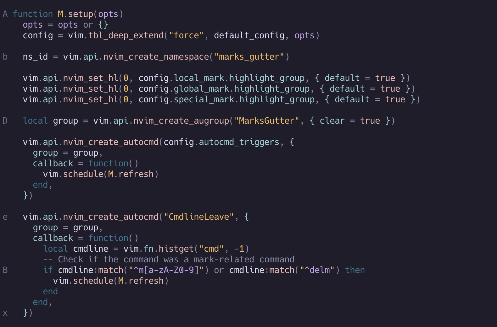
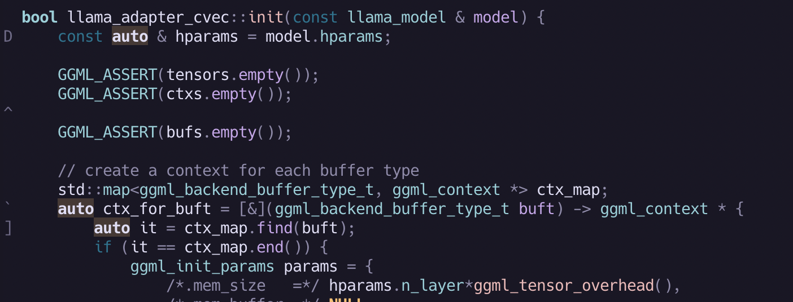
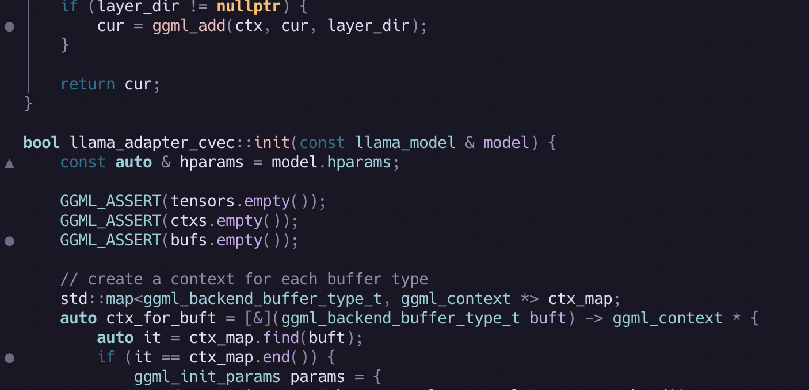

# GutterMarks.nvim

<div align="center">
    [](http://www.lua.org)
    [](https://neovim.io)
    [](https://opensource.org/licenses/MIT)
    <a href="https://dotfyle.com/plugins/dimtion/guttermarks.nvim">
    
  </a>
</div>

A Neovim plugin that displays
[marks](https://neovim.io/doc/user/motion.html#_7.-marks) in the buffer gutter
as signs. Keep track of your marks visually with customizable appearance and
behavior.



## Features

- Display local marks (a-z) in the gutter
- Display global marks (A-Z) in the gutter
- Optional display of special marks (numbers, symbols)
- Configurable sign text and highlight groups
- Automatic refresh on text changes

### Why this plugin

I've been using [marks.nvim](https://github.com/chentoast/marks.nvim) and others
to display marks in the gutter, but I don't need all the extra bells and
whistles that those other plugins added. This is a fast, simple implementation
that doesn't get in the way, and does not change nvim default behavior.

## Installation

### Using [lazy.nvim](https://github.com/folke/lazy.nvim)

```lua
{
  "dimtion/guttermarks.nvim",
  event = { "BufReadPost", "BufNewFile", "BufWritePre" },
}
```

### Using [vim-plug](https://github.com/junegunn/vim-plug)

```vim
Plug 'dimtion/guttermarks.nvim'
```

## Configuration

Optionally use `setup(opts)` function to configure the plugin:

```lua
require("guttermarks").setup({
  global_mark = { enabled = false },
})
```

See [full default configuration](lua/guttermarks/config.lua):
```lua
{
  local_mark = {
    enabled = true,
    sign = nil,
    highlight_group = "GutterMarksLocal",
    priority = 10,
  },
  global_mark = {
    enabled = true,
    sign = nil,
    highlight_group = "GutterMarksGlobal",
    priority = 11,
  },
  special_mark = {
    enabled = false,
    sign = nil,
    marks = { "'", "^", ".", "[", "]", "<", ">", '"', "`", '"', "0", "1", "2", "3", "4", "5", "6", "7", "8", "9" },
    highlight_group = "GutterMarksSpecial",
    priority = 10,
  },
  excluded_filetypes = { "" },
  excluded_buftypes = {},
  -- Advanced: Customize Autocmd events that trigger a refresh
  autocmd_triggers = {
    "BufEnter",
    "BufWritePost",
    "TextChanged",
    "TextChangedI",
  },
}
```

## Commands

| Command | Description |
|---------|-------------|
| `:GutterMarks toggle` | Toggle guttermarks display on/off |
| `:GutterMarks enable` | Enable guttermarks display |
| `:GutterMarks disable` | Disable guttermarks display |
| `:GutterMarks refresh` | Force refresh guttermarks display |

## Customizing Highlights

You can customize the default [highlight groups](https://neovim.io/doc/user/syntax.html) in your colorscheme or `init.lua`:

```lua
vim.api.nvim_set_hl(0, "GutterMarksLocal", { fg = "#ffff00" })
vim.api.nvim_set_hl(0, "GutterMarksGlobal", { fg = "#ff0000", bold = true })
vim.api.nvim_set_hl(0, "GutterMarksSpecial", { fg = "#00ff00", italic = true })
```

## Advanced configuration

### Enable Special Marks



```lua
require("guttermarks").setup({
  special_mark = { enabled = true },
})
```

### Using Custom Signs



```lua
require("guttermarks").setup({
  local_mark = { sign = "▶" },
  global_mark = { sign = "▲" },
  special_mark = {
    enabled = true,
    sign = "●",
  },
})
```

### Minimal Setup for Local Marks Only

```lua
require("guttermarks").setup({
  global_mark = { enabled = false },
  special_mark = { enabled = false },
})
```

### Function passed for sign

```lua
require("guttermarks").setup({
  global_mark = {
    sign = function(mark)
      -- Show the mark letter with a prefix
      return "G" .. mark.mark
    end,
  },
})
```

## GutterMarks Actions

To make marks more effective in vim, GutterMarks comes with a few actions that
can be used by creating key mappings:

```lua
-- Delete the mark under the cursor
vim.keymap.set("m;", require("guttermarks.actions").delete_mark)

-- Navigate to next/previous mark in current buffer
vim.keymap.set("]m", require("guttermarks.actions").next_buf_mark)
vim.keymap.set("[m", require("guttermarks.actions").prev_buf_mark)

-- Send marks to quickfix (and open it)
vim.keymap.set("<leader>mq", function()
    require("guttermarks.actions").marks_to_quickfix()
    vim.cmd("copen")
end)

-- Send marks to quickfix (include special marks)
vim.keymap.set("<leader>mQ", function()
    require("guttermarks.actions").marks_to_quickfix({
        special_mark = true,
    })
    vim.cmd("copen")
end)
```

## Vim Marks cheat-sheet

- Use `ma` to set local mark 'a', `mA` for global mark 'A'
- Jump to marks with `'a` (local) or `'A` (global)
- Use `` `a `` to jump to exact position (line and column) of mark 'a'
- Delete mark 'a' with `:delmarks a`
